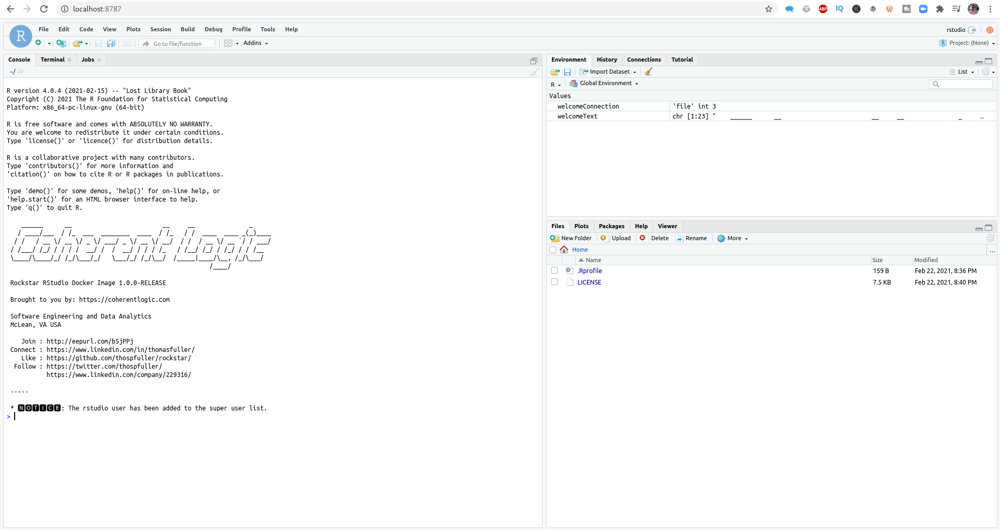
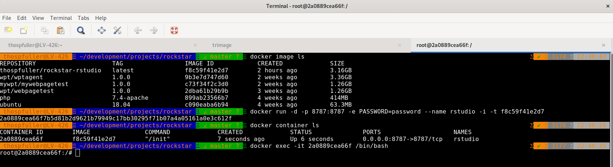

# Rockstar: A Rocker RStudio image preconfigured with [rJava](https://cran.r-project.org/web/packages/rJava/index.html), [OpenJDK Java 11](https://openjdk.java.net/projects/jdk/11/), and other packages.

[](http://www.gnu.org/licenses/lgpl-3.0.html) [](https://www.linkedin.com/in/thomasfuller/) [](https://twitter.com/ThosPFuller) [](https://github.com/thospfuller) [](http://eepurl.com/b5jPPj) [](https://coherentlogic.com?utm_source=rockstar_on_gh) [](https://www.meetup.com/Washington-DC-CTO-Meetup-Group/)

The _Rockstar RStudio_ Dockerfile inherits from [rocker/rstudio](https://hub.docker.com/r/rocker/rstudio/) and contains the following:
- [rJava: Low-Level R to Java Interface](https://cran.r-project.org/web/packages/rJava/index.html) and [OpenJDK 11](https://openjdk.java.net/projects/jdk/11/)
- [drat: 'Drat' R Archive Template](https://cran.r-project.org/web/packages/drat/index.html)
- [RJSONIO: Serialize R Objects to JSON, JavaScript Object Notation](https://cran.r-project.org/web/packages/RJSONIO/index.html)
- [packrat: A Dependency Management System for Projects and their R Package Dependencies](https://cran.r-project.org/web/packages/packrat/index.html)
- [xml2: Parse XML](https://cran.r-project.org/web/packages/xml2/index.html)
- [roxygen2: In-Line Documentation for R](https://cran.r-project.org/web/packages/roxygen2/index.html)
- [devtools: Tools to Make Developing R Packages Easier](https://cran.r-project.org/web/packages/devtools/index.html)
- [logging: R Logging Package](https://cran.r-project.org/web/packages/logging/index.html)

Note also that the _rstudio_ user has been added to the sudo group.

Rockstar is used by the [RCOBOLDI (R COBOL Data Integration) Package](https://github.com/thospfuller/rcoboldi), which is an R package for importing COBOL CopyBook data into the R Project as data frames.

Rockstar can also be helpful for data scientists or data engineers who need to use R with rJava. The rJava package can be slightly involved to set up and the Rockstar RStudio Dockerfile will help you get past this. The Rockstar RStudio Dockerfile can also act as a referece for engineers that need to configure rJava with a JDK or JRE.

## The [*Rockstar images*  are available on *DockerHub*](https://hub.docker.com/repository/docker/thospfuller/rockstar-rstudio)

[The *Rockstar project* can be found on *GitHub*](https://github.com/thospfuller/rockstar) and [*Rockstar images* can be found on *DockerHub*](https://hub.docker.com/repository/docker/thospfuller/rockstar-rstudio). Below we include instructions for installing the Rockstar RStudio image and then creating a container from this image.

```docker pull thospfuller/rockstar-rstudio:[latest or 1.0.0 or some other tag]```

then

```docker image ls```

should show something like this:

```
> REPOSITORY                     TAG                 IMAGE ID            CREATED             SIZE
> thospfuller/rockstar-rstudio   latest              f8c59f41e2d7        41 minutes ago      3.16GB
```

then

```docker run -d -p 8787:8787 -e PASSWORD=password --name rstudio -i -t f8c59f41e2d7```

Next, browse to [http://localhost:8787](http://localhost:8787) and enter the username 'rstudio' and password 'password' and you should see the following.


*<p align="center">An example of a container created from the Rockstar RStudio docker image running on localhost:8787.</p>*

Finally, command line access to the Rockstar RStudio container can be acquired via the example below -- refer to the image for additional details.

```docker exec -it 2a0889cea66f /bin/bash```


*<p align="center">An example of obtaining shell access to a running Rockstar RStudio container.</p>*
